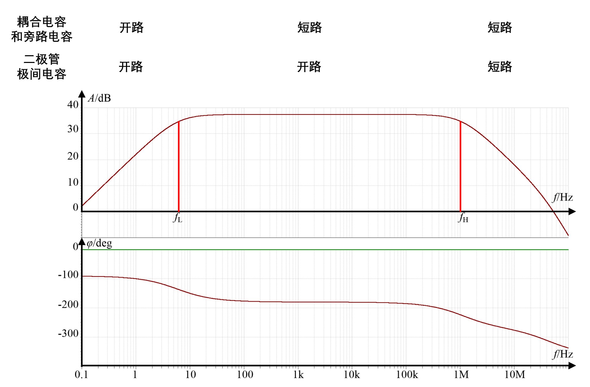

# 电子电路基础

## 第一章 半导体基础知识及二极管电路

### 1.1 半导体的基本特征

- 特性
  - 掺杂特性：电阻下降
  - 热敏特性：T↑，R↓
  - 光敏特性：I↑，R↓
- 本征半导体
- 掺杂半导体
  - N 型（五价）：自由电子——多子，空穴——少子
  - P 型（三价）：空穴——多子，自由电子——少子
- 运动
  - 漂移运动（电场作用）
  - 扩散运动（浓度梯度）

---

1. 在 P 型半导体中：在室温下，当温度升高时，空穴的浓度将会==**近似不变**==.，自由电子的浓度将会==**升高**==

---

### 1.2 半导体二极管的工作原理及特性

- PN 结
  - 空间电荷区：内建电场（多子的扩散，少子的漂移）
  - 耗尽区：载流子少
  - 势垒区、阻挡区：阻碍多子的扩散
  - 高阻区：载流子浓度低
  - 对称结：掺杂浓度相等
  - 正向导通：耗尽区变窄，扩散运动加强，势垒电压-V
  - 反向截止：耗尽区变宽，扩散运动减弱，势垒电压+V
- 二极管的伏安特性

  - 电流方程：$i_{D}=I_{S}(e^{\frac{v_{D}}{V_{T}}}-1)$。其中，$v_{D}$、$i_{D}$两端电压电流；$I_{S}$反向饱和电流；$T=300K$时，$V_{T}\approx26mV$；$T=290K$时，$V_{T}\approx25mV$

    

- 二极管的反向击穿特性

  - 雪崩击穿：掺杂浓度低，外加电压大
  - 齐纳击穿：掺杂浓度高，外加电压小
  - 可逆——电击穿，不可逆——热击穿

- 二极管的温度特性

  

- 二极管的电容效应
  - 势垒电容$C_{T}$：反偏
  - 扩散电容$C_{D}$：正偏
  - 影响高频特性：失去单向导电性
- 特殊二极管
  - 稳压二极管：反向击穿区，串联限流电阻
  - 变容二极管：多用于高频电路

---

1. 设室温情况下某二极管已经正向导通，则当其正偏电压增加 100mV 时，正偏电流的变化是==**约变为原来的 54 倍**==

   > $e^{\frac{100}{25}}\approx54$

2. 二极管的反向电流大小主要决定于少子浓度

---

### 1.3 半导体二极管电路

- 二极管的等效电阻
  - 静态电阻：$R_{D}=\frac{V_{DQ}}{I_{DQ}}$
  - 动态电阻：$r_{d}\approx\frac{V_{T}}{I_{DQ}}$
- 二极管的模型
  - 数学模型
  - 理想化模型
  - 恒压降模型
  - 分段线性模型
  - 交流小信号模型
- 二极管模拟电路
  - 整流电路：单向导电性
  - 限幅电路：开关特性
  - 稳压电路：恒压特性

## 第二章 双极型二极管及其放大电路

### 2.1 双极型晶体管（BJT）

- 掺杂区

  - 基区：薄，掺杂浓度低
  - 集电区：面积大
  - 发射区：掺杂浓度高

- 工作状态

  - 放大：发射结+，集电结-
  - 饱和：++
  - 截止：--
  - 反向：发射结-，集电结+

- 
  - $i_{E}=i_{C}+i_{B}$
  - $i_{C}=\beta i_{B}$
- 共射输入特性曲线
  - 
  - $i_{B}=I_{S}e^{\frac{v_{BE}}{V_{T}}}-1$
  - 基区宽度调制效应
  - 齐纳击穿
- 共射输出特性曲线
  - 
  - 饱和区：饱和压降（$V_{CE(sat)}$），$i_{C}<\beta i_{B}$
  - 放大区：$i_{C}=\beta i_{B}+I_{CBO}$，其中 $I_{CBO}$ 为反向饱和电流，厄尔利电压 $r_{ce}=\frac{V_{A}}{I_{CQ}}$ （ $V_{A}$ 是与负半轴的交点）
  - 截止区：$i_{B}=0$，集电极、基极开路，$i_{C}=-i_{B}=I_{CBO}$
  - 击穿区：雪崩击穿。$i_{B}\uparrow$，$V_{(BR)CEO}\downarrow$
- 温度影响
  - $T\uparrow$，$v_{BE}\downarrow$
  - $T\uparrow$，$I_{CBO}\uparrow$
  - $T\uparrow$，$\beta\uparrow$
- 晶体管的参数
  - 放大系数：共射 $\beta$ ，共基 $\alpha$ ， $\alpha=\frac{\beta}{1+\beta}$
  - 反向电流：饱和 $I_{CBO}$ 、饱和 $I_{EBO}$ 、穿透 $I_{CEO}$
  - 集电极最大电流 $I_{CM}$ ：当$\beta=\frac{2}{3}max\{\beta\}$时
  - 击穿电压：$V_{(BR)CBO}$ 、 $V_{(BR)EBO}$ 、 $V_{(BR)CEO}$
  - 集电极最大耗散功率 $P_{CM}=max\{p_{C}\}=max\{i_{C}v_{CE}\}$
  - 高频参数：$f_{\alpha}>>f_{T}>f_{\beta}$
- 集成电路特点
  - 良好的对称性。但性能参数绝对误差大
  - 电阻不宜过大或过小。用有源元件代替电阻、电容等无源元件
  - 不能制作大电容
  - 不能制作电感

---

1. 放大电路的有效输入信号必须加在发射结上

2. 晶体管处于放大状态时，$i_{C}$和$i_{B}$的关系是==**线性**==，$ic$和$v_{BE}$的关系是==**指数**==，$\Delta i_{c}$和$\Delta v_{BE}$的关系是==**线性**==

   > $i_{C}=\beta i_{B}$

---

### 2.2 放大电路的基本知识

- 直流工作点：设置$V_{BB}$、$V_{CC}$，为了时晶体管始终工作于放大区（线性区），信号不失真
- $R_{C}\uparrow$，$A\uparrow$
- 性能指标
  - 输入抗阻、输出抗阻
  - 增益：$\dot{A}_{v}(dB)=20lg\dot{A}_{v}$
  - 通频带：$BW=f_{H}-f_{L}$（中频区）
  - 非线性失真
  - 最大输出幅度
  - 最大输出功率
  - 效率：$\eta=\frac{P_{o}}{P_{DC}}$

---

1. 放大电路的输入电阻与负载值有关
2. 放大电路的输出电阻与信号源内阻大小有关
3. 负载电阻越大，输出电阻不一定越大
4. 处于放大状态的双极型晶体管的集电极输出电阻呈现如下特征==**交流电阻大于直流电阻**==
5. 放大的输出电阻与负载电阻不呈现正相关关系

---

### 2.3 基本共射放大电路的工作原理和分析方法

- 直流分析（静态分析）、交流分析（动态分析），在线性区可以用叠加定理

- 图解法

  - 饱和失真（非线性）
  - 截止失真（非线性）

- 等效电路法

  - 简化直流模型

    $\left\{ \begin{array}{ll}  I_{BQ}=\frac{V_{CC}-V_{BEQ}}{R_{B}} \\I_{CQ}=\beta I_{BQ} \\ V_{VEQ}=V_{CC}-R_{C}I_{CQ} \end{array} \right.$

  - 混合$\pi$模型（交流小信号）

    $\left\{ \begin{array}{ll}  r_{be}=r_{bb^{'}}+r_{b^{‘}e}=r_{bb^{'}}+(1+\beta)\frac{V_{T}}{I_{EQ}} \\ g_{m}=\frac{\beta}{r_{b^{‘}e}}=\frac{I_{CQ}}{V_{T}} \\ r_{ce}=\frac{V_{A}}{I_{CQ}} \end{array} \right.$

---

1. 大部分情况下，交流负载线斜率（$-\frac{1}{R_{L}^{‘}}$）的绝对值要大于直流负载线斜率（$-\frac{1}{R_{C}}$）的绝对值
2. 晶体管特性的变化不会对直流负载线产生影响
3. 使用等效电路法不能求出放大电路的==**功率效率**==

---

### 2.4 放大电路的静态工作点稳定问题

- $\left\{ \begin{array}{ll} V_{BB}=\frac{R_{B2}}{R_{B1}+R_{B2}}V_{CC} \\ R_{B}=R_{B1}//R_{B2} \\ I_{BQ}=\frac{V_{BB}-V_{BEQ}}{R_{B}+(1+\beta)R_{E}} \\ I_{CQ}=\beta I_{BQ} \\ V_{CEQ}\approx V_{CC}-(R_{C}+R_{E})I_{CQ} \end{array} \right.$

### 2.5 晶体管单管放大三种基本组态

- 共集放大电路——射极跟随器

| 类别 | 相位 |    增益    |                 特点                 |   高频特性   |              主要用途              |
| :--: | :--: | :--------: | :----------------------------------: | :----------: | :--------------------------------: | ---- | -------- |
| 共射 | 反相 | 电流、电压 |                  $                   | \dot{A}\_{v} |       $大，$R*{i},R*{o}$适中       | 不好 | 增益最大 |
| 共集 | 同相 |    电流    |          $R_{i}$大$R_{o}$低          |      好      | 输入级、输出级、缓冲级、电流驱动力 |
| 共基 | 同相 |    电压    | $\dot{A}_{v},R_{o}$同共射，$R_{i}$小 |      好      |              高频电路              |

---

1. 若信号源为电流源，多级放大电路的输入级适宜采用==**共基组态**==电路。
2. 不能通过直流通路判断放大电路组态

---

### 2.6 电流源电路及其应用

- 镜像电流源

  - 使两个二极管的$v_{B}$相等

  - $I_{R}=(1+\frac{2}{\beta})I_{0}$

  - 缓冲管：提高镜像精度（$I_{R}=1+\frac{2}{\beta_{1}(1+\beta_{3})}I_{0}$）
  - 射极电阻：输出电阻变大、稳定性增强（电流负反馈）

- 威尔逊电流源

- 比例电流源

- 微电流源

- 多路电流源

- 应用

  - 直流偏置电路：提供稳定的电源
  - 有源负载：① 较高的电路增益。② 合适的静态工作点。③ 较宽的动态范围

### 2.7 差分放大电路

- 共模信号：$v_{IC}=\frac{1}{2}(v_{I1}+v_{I2})$（平均）

- 差模信号：$v_{ID}=v_{I1}-v_{I2}$（差）

- 放大差模信号，抑制共模信号

- 扩大线性区：加入射极电阻，但增益减小

  - 差模分析
    | 输出方式 | 差模增益 | 输入电阻 | 输出电阻 |
    | :------: | :----------------------------------------------------------: | :-------: | :------: |
    | 单端输出 | $\dot{A}_{vd1}=\frac{1}{2}\dot{A}_{vd}=-\frac{1}{2}\frac{\beta R_{L}^{'}}{r_{be}}$ | $2r_{be}$ | $R_{C}$ |
    | 双端输出 | $\dot{A}_{vd}=\frac{V_{od}}{V_{id}}=\frac{V_{od1}-V_{od2}}{V_{i1}-V_{i2}}=\frac{2V_{od1}}{2V_{i1}}=\frac{V_{od1}}{V_{i1}}=-\frac{\beta R_{L}^{'}}{r_{be}}$ | $2r_{be}$ | $2R_{C}$ |
  - 共模分析
    | 输出方式 | 共模增益 | 输入电阻 | 输出电阻 |
    | :------: | :----------------------------------------------------------: | :------: | :------: |
    | 单端输出 | $\dot{A}_{vc}=\frac{V_{oc1}}{V_{ic}}=-\frac{\beta R_{L}^{'}}{r_{be}+(1+\beta)2R_{EE}}\approx-\frac{R_{L}^{'}}{2R_{EE}}$ | $$ | $R_{C}$ |
    | 双端输出 | $0$ | $$ | $2R_{C}$ |

- 共模抑制比
  - $K_{CMR}=|\frac{\dot{A}_{vd}}{\dot{A}_{vc}}|$
  - 双端输出：$|\dot{A}_{vc}|=0$，$K_{CMR}\rightarrow\infty$
  - 单端输出：$K_{CMR}\approx\frac{\beta R_{EE}}{r_{be}}$
- 有源负载差放电路

  - 单端输出与双端输出相同

- 非理想差放电路

  - 双端输出的抑制共模比：$K_{CMR}=|\frac{\dot{A}_{vd}}{A_v(c-d)}|$，其中 $\dot{A}_{v(c-a)}=\frac{v_{oc1}-v_{voc2}}{v_{ic}}$

  - 输入失调电压：零输入时，输出电压不为零
  - 输入失调电流
  - 温漂
  - 调零电路

### 2.8 功率放大电路

- 分类
  - 甲类（最高 50%）
  - 甲乙类
  - 乙类
  - 丙类
  - 导通角$\theta$
  - 下移静态点 Q，使得静态功耗降低。越低，效率越高，但非线性失真越严重
- 互补功放
  - 乙类（交越失真——非线性失真）
  - 甲乙类
- 参数计算
  - 输出功率 $P_{o}=\frac{V_{om}}{\sqrt{2}}\cdot\frac{I_{om}}{\sqrt{2}}=\frac{V_{om}^{2}}{2R_{L}}$
    - 电源供给功率 $P_{DC}=2\times\frac{1}{2\pi}\int_{0}^{\pi}V_{CC}I_{cm}\sin\omega td(\omega t)=\frac{2V_{CC}}{\pi}\cdot\frac{V_{om}}{R_{L}}$
  - 效率 $\eta=\frac{P_{o}}{P_{DC}}=\frac{\pi}{4}\cdot\frac{V_{om}}{V_{CC}}$
    - $\eta_{max}=\frac{\pi}{4}\cdot\frac{V_{CC}-V_{CE(sat)}}{V_{CC}}\approx\frac{\pi}{4}\times100\%\approx78.5\%$
- 参数选择
  - $I_{CM}\ge\frac{V_{CC}}{R_{L}}$
  - $V_{(BR)CEO}\ge 2V_{CC}$
  - $P_{CM}\ge\frac{2}{\pi^{2}}\cdot\frac{V_{CC}^{2}}{R_{L}}\approx0.2P_{omax}$
- 双电源供电：OCL 电路
- 单电源供电：OTL 电路
  - 自举电路
- 复合管准互补电路
  - 前一级的集电极或发射极一定接后一级的基极
  - 复合管型与前一级相同
  - $\beta=\beta_{1}\beta_{2}$
  - 缺点：① $\beta$ 稳定性差。② $f_{\beta}$ 低

---

1. 对于乙类互补放大电路，电路输出功率最大时刻不是管耗功率最大时刻

---

### 2.9 多级放大电路

- 阻容耦合、变压器耦合、直接耦合（能够集成）
- 级间直流电位匹配：直流电平移动电路
- 零点漂移：差放电路（首级）
- $|\dot{A}_{v}|=|\dot{A}_{v1}|\cdot|\dot{A}_{v2}|\cdots\cdot|\dot{A}_{vn}|$
  - 方法一：前级的开路电压和输出电阻作为后级的信号源
  - 方法二：前级输出电阻作为信号源内阻，后级输入电阻作为负载电阻
- 级数越多，通频带越窄
- 输入电阻：第一级输入电阻。第一级为共集时，要考虑下一级的输入电阻
- 输出电阻：最后一级输出电阻。最后一级为共集时，要考虑前一级的输出电阻

## 第三章 场效应晶体管及其放大电路

### 3.1 MOS 场效应管

- 截止区——截止区
- 饱和区——放大区
- 可变电阻区——饱和区
- 栅极——基极
- 漏极——集电极
- 源极——发射极
- 微变输出电阻 $r_{ds}=\frac{\Delta v_{DS}}{\Delta i_{D}}\approx\frac{V_{A}}{I_{DQ}}=\frac{1}{\lambda\cdot I_{DQ}}$
- 衬底调制效应：$g_{mb}=\eta\cdot g_{m}$
- 增强型
  - 微变跨导 $g_{m}=\frac{\Delta i_{D}}{\Delta v_{GS}}=\frac{2I_{DQ}}{V_{GSQ-V_{th}}}$
  - 饱和区电流 $i_{D}=\frac{k_{p}}{2}\cdot\frac{W}{L}(v_{GS}-V_{th})^{2}$
- 耗尽型
  - 微变跨导 $g_{m}=\frac{\Delta i_{D}}{\Delta v_{GS}}=\frac{2I_{DQ}}{V_{GSQ-V_{off}}}$
  - 饱和区电流 $i_{D}=\frac{k_{p}}{2}\cdot\frac{W}{L}(v_{GS}-V_{off})^{2}=I_{DSS}(1-\frac{v_{GS}}{V_{off}})^{2}$

### 3.2 结型场效应管（JEFT）

- 饱和区电流 $i_{D}=\frac{k_{p}}{2}\cdot\frac{W}{L}(v_{GS}-V_{off})^{2}=I_{DSS}(1-\frac{v_{GS}}{V_{off}})^{2}$

|   类型   |     N 增强型     |     N 耗尽型      | P 增强型  |   P 耗尽型    |       N 结型       |       P 结型       |
| :------: | :--------------: | :---------------: | :-------: | :-----------: | :----------------: | :----------------: | -------------- | --- | ----------------- | --- | -------------- | --- |
|          |        可        |        变         |    电     |      阻       |         区         |                    |
| $v_{GS}$ |    $>V_{th}$     |    $>V_{off}$     | $<V_{th}$ |  $<V_{off}$   | $V_{off}<v_{GS}<0$ | $0<v_{GS}<V_{off}$ |
| $v_{DS}$ | $<v_{GS}-V_{th}$ | $<v_{GS}-V_{off}$ |    $<     | v*{GS}-V*{th} |         $          |         $<         | v*{GS}-V*{off} | $   | $<v_{GS}-V_{off}$ | $<  | v*{GS}-V*{off} | $   |
| $v_{GD}$ |    $>V_{th}$     |    $>V_{off}$     | $<V_{th}$ |  $<V_{off}$   | $V_{off}<v_{GD}<0$ | $0<v_{GS}<V_{off}$ |
| 电流方程 |                  |                   |           |               |                    |                    |
|          |                  |        饱         |    和     |      区       |                    |                    |
| $v_{GS}$ |    $>V_{th}$     |    $>V_{off}$     | $<V_{th}$ |  $<V_{off}$   | $V_{off}<v_{GS}<0$ | $0<v_{GS}<V_{off}$ |
| $v_{DS}$ | $>v_{GS}-V_{th}$ | $>v_{GS}-V_{off}$ |    $>     | v*{GS}-V*{th} |         $          |         $>         | v*{GS}-V*{off} | $   | $>v_{GS}-V_{off}$ | $>  | v*{GS}-V*{off} | $   |
| $v_{GD}$ |    $<V_{th}$     |    $<V_{off}$     | $>V_{th}$ |  $>V_{off}$   |     $<V_{off}$     |     $>V_{off}$     |
| 电流方程 |                  |                   |           |               |                    |                    |
|          |                  |        截         |    止     |      区       |                    |                    |
| $v_{GS}$ |    $<V_{th}$     |    $<V_{off}$     | $>V_{th}$ |  $>V_{off}$   |     $<V_{off}$     |     $>V_{off}$     |
| $v_{DS}$ |       $>0$       |       $>0$        |   $<0$    |     $<0$      |        $>0$        |        $<0$        |
| $v_{GD}$ |    $<V_{th}$     |    $<V_{off}$     | $>V_{th}$ |  $>V_{off}$   |     $<V_{off}$     |     $>V_{off}$     |
| 电流方程 |       $0$        |        $0$        |    $0$    |      $0$      |        $0$         |        $0$         |

### 3.4 场效应管放大电路

- 微变信号模型
- 直流偏置电路
  - 分压式偏置
  - 自给式偏置（只适用于耗尽型和结型 EFT）
- 放大电路
  - 共源——共射
  - 共栅——共基
  - 共漏——共集（源极跟随器）
- 有源电阻
  - 增强型栅极、漏极短接
  - 耗尽型栅极、源极短接
- 电流源
- 有源负载放大
  - NMOS 共源 E/E 型
  - NMOS 共源 E/D 型
  - CMOS 共源 E/E 型（没有衬底调制效应，漏极负载电阻大大提高，从而提高增益）
- 差放
  - 基本差放
  - 有源负载差放

---

1. 放大（饱和）状态下，双极型晶体管的输出电流和输入电压的（全值）关系为==**指数型**==，场效应型晶体管的输出电流和输入电压的（全值）关系为==**二次函数型**==。

---

## 第四章 小信号放大电路的频率特征

- $\begin{eqnarray} A & = & a + jb \\ & = & |A|(\cos\varphi+j\sin\varphi) \\ & = & |A|e^{j\varphi} \\ & = & |A|\angle\varphi \end{eqnarray}$

### 4.1 频率特征概述

- 幅度失真、相位失真——线性失真（若输出产生了输入没有的新频率，则是非线性失真）
- $\dot{A}_{v}=\frac{V_{o}}{V_{i}}=|\dot{A}_{v}(\omega)|e^{j\varphi(\omega)}$
  - 幅频特性 $|\dot{A}_{v}(\omega)|$
  - 相频特性 $\varphi(\omega)$
  - 
- $\dot{A}_{v}(\omega)=K\frac{(j\omega+\omega_{z1})(j\omega+\omega_{z2})\cdots(j\omega+\omega_{zn})}{(j\omega+\omega_{p1})(j\omega+\omega_{p2})\cdots(j\omega+\omega_{pn})}$
  - $\omega_{z}$ 零点角频率
  - $\omega_{p}$ 极点角频率
- 波特图
  - $\begin{eqnarray} |\dot{A}_{v}\omega)| & = & |\dot{A}_{v1}(\omega)| |\dot{A}_{v2}(\omega)|\cdots|\dot{A}_{vn}(\omega)| \\ & = & 20\lg|\dot{A}_{v1}(\omega)|+20\lg|\dot{A}_{v2}(\omega)|+\cdots+20\lg|\dot{A}_{vn}(\omega)| (dB)\end{eqnarray}$
  - $\varphi(\omega)=\varphi_{1}(\omega)+\varphi_{2}(\omega)+\cdots+\varphi_{n}(\omega)$
- $\dot{H}$网络
  - 实常数 $\dot{H}=C=Ce^{j0}$ 、 $\dot{H}=-C=Ce^{\pm j\pi}$
  - 虚函数 $\dot{H}=\pm\frac{j\omega}{\omega_{0}}=\frac{\omega}{\omega_{0}}e^{\pm j\frac{\pi}{2}}$ 、 $\dot{H}=\pm\frac{j\omega_{0}}{\omega}=\frac{\omega_{0}}{\omega}e^{\pm j\frac{\pi}{2}}$
  - 低通滤波电路 $\dot{A}_{v}(\omega)=\frac{1}{1+j(\omega/\omega_{H})}$ 、 $|\dot{A}_{v}(\omega)|=\frac{1}{\sqrt{1+(\omega/\omega_{H})^{2}}}$ 、 $\varphi(\omega)=-\arctan{\frac{\omega}{\omega_{H}}}$
  - 高通滤波电路 $\dot{A}_{v}(\omega)=\frac{1}{1-j(\omega_{L}/\omega)}$ 、 $|\dot{A}_{v}(\omega)|=\frac{1}{\sqrt{1+(\omega_{L}/\omega)^{2}}}$ 、 $\varphi(\omega)=\arctan{\frac{\omega_{L}}{\omega}}$
- $\omega=\omega_{H}/\omega_{L}$ （截止频率），增益比通频带增益下降 $3$ dB，产生 $\pm45^{\circ}$ 的相移
- 多级放大电路
  - $|A(jf)|=\frac{|A_{m1}A_{m2}\cdots A_{mn}|}{\sqrt{1+(f/f_{H1})^{2}}\sqrt{1+(f/f_{H2})^{2}}\cdots\sqrt{1+(f/f_{Hn})^{2}}}$
  - $\frac{1}{f_{H}}\approx1.1\sqrt{\frac{1}{f_{H1}^{2}}+\frac{1}{f_{H2}^{2}}+\cdots+\frac{1}{f_{Hn}^{2}}}$
  - $|A(jf)|=\frac{|A_{m1}A_{m2}\cdots A_{mn}|}{\sqrt{1+(f_{L1}/f)^{2}}\sqrt{1+(f_{L2}/f)^{2}}\cdots\sqrt{1+(f_{Ln}/f)^{2}}}$
  - $f_{L}\approx1.1\sqrt{f_{L1}^{2}+f_{L2}^{2}+\cdots+f_{Ln}^{2}}$

### 4.2 晶体管结电容对放大电路高频特性的影响

- 高频小信号模型（密勒模型）
  - 通常用于共射电路
  - $C_{M}>>C_{b^{'}e}$
  - $C_{M^{‘}}\approx C_{b^{'}e}$
- 频率参数 $\dot{\beta}=\frac{\dot{I_{C}}}{\dot{I_{B}}}\approx\frac{\beta_{0}}{1+j\frac{f}{f_{\beta}}}$
  - $f_{\beta}=\frac{1}{2\pi r_{b^{'}e}(C_{b^{'}e}+C_{b^{'}c})}$
  - $f_{T}=\beta_{0}f_{\beta}=\frac{g_{m}}{2\pi(C_{b^{'}e}+C_{b^{'}c})}$
  - $f_{\alpha}=(1+\beta_{0})f_{\beta}=\frac{1}{2\pi r_{e}(C_{b^{'}e}+C_{b^{'}c})}$

### 4.3 双极型晶体管放大电路的频率特性

- 单管共射
  - $f_{H}=\frac{1}{2\pi R_{s}^{'}C_{i}}$
  - $GBW=|\dot{A}_{vsm}|f_{H}\approx\frac{1}{2\pi(R_{s}+r_{bb^{'}})C_{b^{'}c}}$

### 4.4 场效应管共源放大电路的频率特性

## 第五章 反馈放大电路

### 5.1 反馈的基本概念及判断方法

- 开环增益 $\dot{A}=\frac{\dot{X}_{o}}{\dot{X}_{id}}$
- 闭环增益 $\dot{A}_{f}=\frac{\dot{X}_{o}}{\dot{X}_{i}}$
- 反馈系数 $\dot{F}=\frac{\dot{X}_{f}}{\dot{X}_{o}}$
- 输出取样电路
  - 电压取样（同极）
  - 电流取样（不同极）
- 输入求和电路
  - 串联求和（电压相加）（不同极）
  - 并联求和（电流相加）（同极）
- 反馈极性
  - 正反馈
  - 负反馈
- 基本方程式：$\dot{A}_{f}=\frac{\dot{X}_{o}}{\dot{X}_{i}}=\frac{\dot{X}_{o}}{\dot{X}_{id}+\dot{X}_{f}}=\frac{\dot{A}\dot{X}_{id}}{\dot{X}_{id}+\dot{A}\dot{F}\dot{X}_{id}}=\frac{\dot{A}}{1+\dot{A}\dot{F}}$
- 环路增益：$\dot{X}_{f}=\dot{A}\dot{F}\dot{X}_{id}$
- 反馈深度：$\dot{D}=1+\dot{A}\dot{F}$

---

1. 在三极管负反馈放大电路中，若保持负载不变，欲从信号源获取较小的电流，并能够在更换放大管时稳定输出电流，可在放大电路中引入==**电压串联、电流串联**==负反馈。
2. 负反馈只能改善反馈环路内的电路性能，对反馈环路之外无效
3. 只要放大电路的负载恒定，不管哪种反馈都能稳定输出电压

---

### 5.2 负反馈电路对放大电路性能的影响

- 提高增益稳定性
- 输入电阻
  - 串联求和（电压）——提高输入电阻
  - 并联求和（电流）——降低输入电阻
- 输出电阻
  - 电压取样——降低输出电阻
  - 电流取样——提高输出电阻
- 减小非线性失真
- 展宽频带

### 5.3 负反馈放大电路的分析方法

- 闭环增益：$\dot{A}_{f}=\frac{\dot{X}_{o}}{\dot{X}_{i}}=\frac{\dot{A}}{1+\dot{A}\dot{F}}\approx\frac{1}{\dot{F}}$
- 虚短：$\left\{ \begin{array}{ll} \dot{X}_{i}\approx\dot{X}_{f} \\ \dot{X}_{id}=\dot{X}_{i}-\dot{X}_{f}\approx0 \end{array} \right.$
- 虚断：$\left\{ \begin{array}{ll} \dot{V}_{id}\approx0 \\ \dot{I}_{id}\approx0 \end{array} \right.$

### 5.4 负反馈放大电路的稳定性分析

- 自激振荡：$\left\{ \begin{array}{ll} |\dot{A}\dot{F}|=1 \\ \Delta\varphi_{A}+\Delta\varphi_{F}=\pm180^{\circ} \end{array} \right.$

## 第六章 模拟集成电路及其应用

### 6.4 集成运算放大器的同相和反相放大电路

- 线性运用
  - 深度负反馈
  - 虚短：$v_{P}\approx v_{N}$
  - 虚断：$i_{P}\approx i_{N}\approx0$
- 非线性应用
  - 无反馈（开环）或正反馈
- 输入方式
  - 反相输入：① 反相。②$R_{if}\approx0$，$R_{if}^{'}=R_{1}$。③$R_{of}\approx0$。
  - 同相输入：①$R_{if}\rightarrow\infty$，$R_{of}\rightarrow0$。② 没有虚地。③ 共模输入 = 输入电压
- 电压跟随器
  - 射极跟随器

---

1. 线性工作的运放，两个输入端对地的直流电阻必须相等，来防止输入偏置电流带来的运算误差

---

### 6.5 由集成运算放大器构成的模拟运算电路

- 反相加法器
- 同相加法器
- 差分输入减法器
- 反相求和减法器
- 基本积分电路
  - $t=-\frac{V_{OL}}{V_{m}}RC$
- 同相积分电路
- 微分电路
- 对数电路
- 指数电路
- 乘法电路
- 除法电路

### 6.7 模拟乘法器及其应用

- $R_{ix}\rightarrow\infty$，$R_{iy}\rightarrow\infty$
- $R_{o}\rightarrow0$

### 6.9 电压比较器

- 过零比较器
- 单限比较器
- 滞回比较器
  - $\Delta V_{th}=V_{th2}-V_{th1}$

## 第七章 脉冲信号的产生与处理电路

### 7.6 多谐振荡器

- $T=2RC\ln(1+\frac{2R_{1}}{R_{2}})$

### 7.7 三角波发生器与锯齿波发生器

- 三角波发生器
  - 多谐振荡器 + 积分电路
  - $V_{th1}=+\frac{R_{1}}{R_{2}}V_{Z}$
  - $V_{th2}=-\frac{R_{1}}{R_{2}}V_{Z}$
- 锯齿波发生器
  - $T_{1}\approx2R_{4}^{'}C\frac{R_{1}}{R_{2}}$
  - $T_{2}\approx2R_{4}^{''}C\frac{R_{1}}{R_{2}}$

## 第十章 直流电源

- 整流电路
  - 半波整流
  - 全波整流
- 滤波电路
- 稳压电路
  - 串联型线性
  - 串联开关型（降压电路）
  - 并联开关型（升压电路）

---

1. 对于串联开关电源调整管功耗主要取决于==**调整管饱和压降和输出电流**==
2. 在直流稳压电源中，==**滤波电路的采用使脉动系数降低**==

---

## 第二章逻辑门电路

- TTL：工作速度高、驱动能力强、但功耗大、集成度稍低
- CMOS：集成度高，功耗低，但工作速度略低
- TTL 输入端悬空等于接高电平
- 推挽输出——抗阻低、带负载能力强，提高工作速度，降低功耗
- 三态门：高阻态
- OC 门：输出并联
- OD 门：大电流

---

1. 晶体管饱和越深，灌电流负载的驱动能力越强，但工作速度越慢
2. COMS、TTL 门的输入端通过 10KΩ 电阻接 VCC 时，则该输入是逻辑“1”
3. 相同输入 OC 门的输出连在一起使用也增加灌电流驱动能力
4. TTL 与非门的开、关门电平越接近阈值电压 VT，噪声容限越大
5. 为了增加驱动能力，相同输入时的相同逻辑门输出可以互连在一起使用

---
